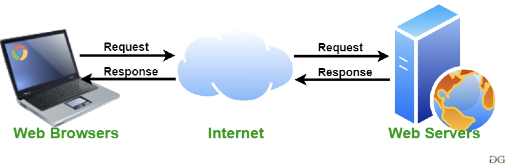
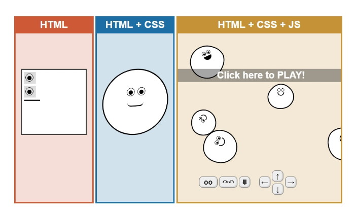
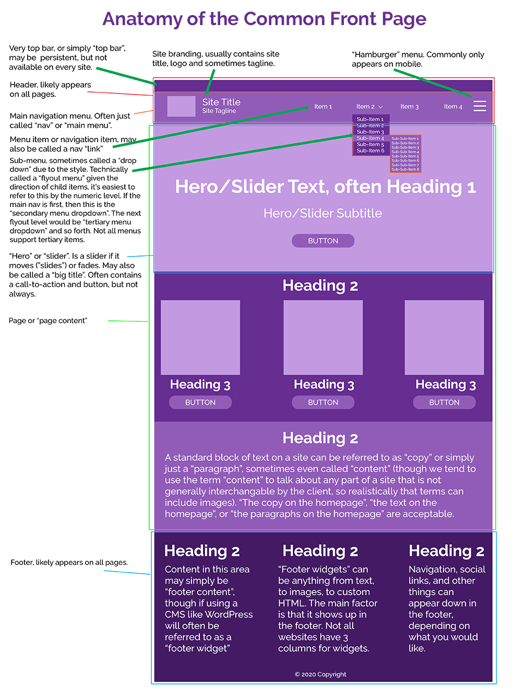
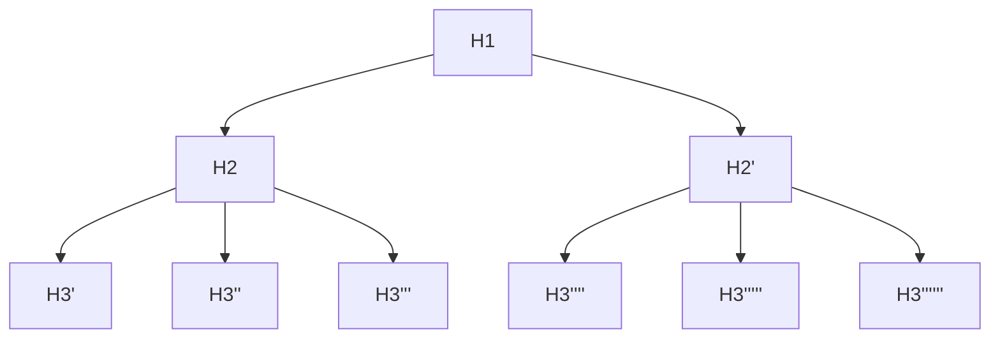
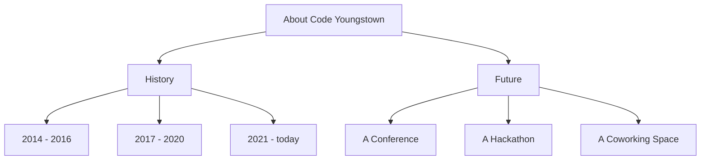
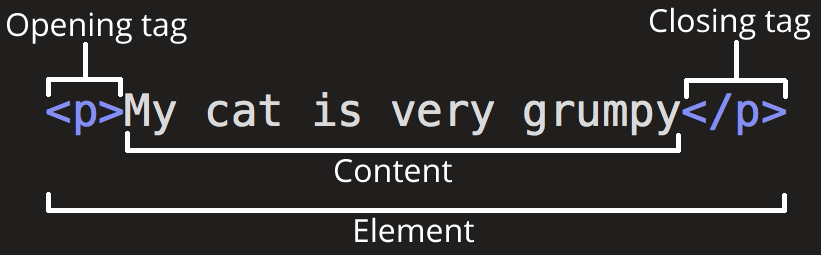
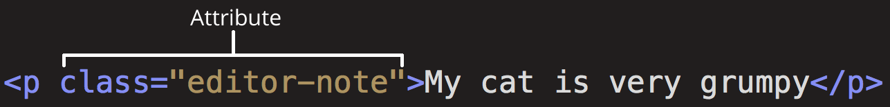
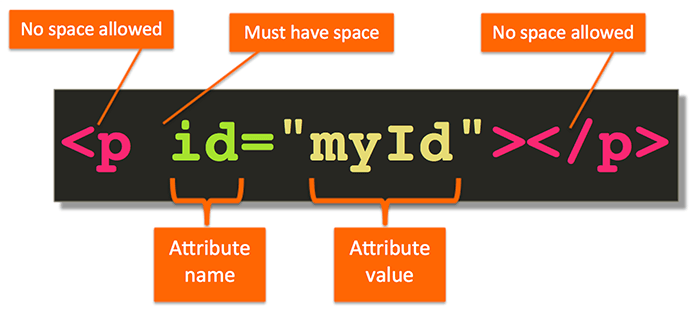
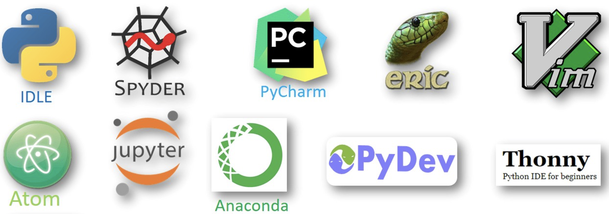

# Websites 101

Dil Rawat 2026-8-24

---

## We're going to build something today

We'll cover the "why"s later, for now, let's start with "how"s!

---

## How websites work



---
---

## What happens when you type a URL?

1. You type `ysu.edu` and hit enter
2. Your browser asks **DNS**: "what's the address for ysu.edu?"
3. DNS answers with an **IP address** (like `137.222.10.5`)
4. Your browser sends an **HTTP request** to that address
5. The server sends back an **HTTP response** — HTML, CSS, images
6. Your browser draws the page

---

## DNS is the internet's phone book

- Humans remember names: `ysu.edu`
- Computers need numbers: `137.222.10.5`
- DNS translates one into the other
- You never see it happen — it takes milliseconds

---

## Protocols: the rules of the conversation

A **protocol** is an agreed-upon way for two computers to talk.

- **HTTP** — HyperText Transfer Protocol. How browsers ask for pages.
- **HTTPS** — the same thing, encrypted. The padlock in your address bar.
  - We'll come back to this when we talk about security.
- **DNS** — how names become addresses.

---

## HTTP status codes

The server always tells you how it went:

- `200` — OK, here's your page
- `404` — Not Found (you've seen this one)
- `500` — Server Error, something broke on their end

---

## What websites are made out of



---

## HTML

For content and layout

```html
<div class="centered">
  <h1>Welcome</h1>
    <div class="pure-u-1-1">
      <p>
        CSIS 1570 - Web Systems and Technologies
      </p>
      <p class="smaller">
        Look at the course description via
        <a href="https://catalog.ysu.edu/courses/csis/">Course Catalog</a> and learn more about our 
        <a href="https://academics.ysu.edu/computer-science-and-information-systems">CSIS Department</a>.
      </p>
    </div>
  </div>
```

---

## CSS

For positioning and styling

```css
body {
  background-color: #222322;
  color: #fff;
  padding: 1em;
}

p {
  font-family: "Open Sans", sans-serif;
  font-weight: 400;
  font-size: 24px;
  margin: 0 0 1em 0;
}

a:link {
  color: #fff;
}
a:visited {
  color: #fff;
}
a:hover {
  color: #ccc;
}
a:active {
  color: #ccc;
}

/* utility */
.centered {
  text-align: center;
}
.smaller {
  font-size: 20px;
}

.blue {
  color: #3498db;
}

.fa-external-link {
  margin-left: 5px;
  transition: color 0.2s ease-in-out;
}
```

---

## JavaScript

For interaction

```js
//add a link icon to the right of every link
//turn it blue when you mouse over the link text
// Wait for the HTML document to fully load
document.addEventListener("DOMContentLoaded", function () {
    
    // Select all links that don't have the "do-not-add-link-icon" class
    const links = document.querySelectorAll("a:not(.do-not-add-link-icon)");
  
    // Loop through each link
    links.forEach(link => {
        // Create an icon element (<i>)
        const icon = document.createElement("i");
        icon.className = "fa fa-external-link hide-when-printing";
        
        // Append the icon right next to the link text
        link.appendChild(icon);
  
        // Add the blue class when the mouse enters the link
        link.addEventListener("mouseenter", function () {
            icon.classList.add("blue");
        });
  
        // Remove the blue class when the mouse leaves
        link.addEventListener("mouseleave", function () {
            icon.classList.remove("blue");
        });
    });
});
```
---

# HTML 101

---

## Anatomy of a web site



---

## Hierarchy of headings



---

## Hierarchy of headings example



---

## The HTML Boilerplate

```html
<!DOCTYPE html>
<html lang="en">
  <head>
    <meta charset="UTF-8" />
    <meta name="viewport" content="width=device-width, initial-scale=1.0" />
    <title>HTML 5 Boilerplate</title>
  </head>

  <body>
    <!-- Content goes here -->
  </body>
</html>
```

---

## Anatomy of an HTML Element



---

## You can also have attributes on HTML Elements



---

## Common HTML Tags

- `<h1></h1>` - `<h6></h6>` for headers - `h1` is largest, `h6` is smallest
- `<p></p>` for paragraphs
- `<ul></ul>` for unordered lists
- `<ol></ol>` for ordered lists
- `<li></li>` for list items
- `<hr `/`>` for horizontal rules (lines)
- `<div></div>` for block divisions
- `<span></span>` for inline divisions

---

## Some notes on spacing HTML Elements


https://docs.sweeting.me/s/anatomy-of-html-css-js

---

# Let's see it in action! But first...

---

## How to write code




---


# Let's code!
- Vs Code + Live Server
- CodePen if you want zero install

---

## The W3C Nu Validator

Your new best friend

---

## Resources

- Mozilla Developer Network (MDN)
  - Guides > HTML
- W3 Schools
  - Tutorials > Learn HTML

---

## Things not to do

- Rename or move `index.html` - it's a standardized default for the `/` page
- Not run the w3 Validator before you submit - I will literally run it when I grade
- Not submit the assignment

---

# Questions?

---

## One last thing...

---

## We will publish to GitHub Pages (Later in the course)

This is totally not course content, but what's the point of making web sites if you can't publish them?


Slides Credit: Joe Duncko