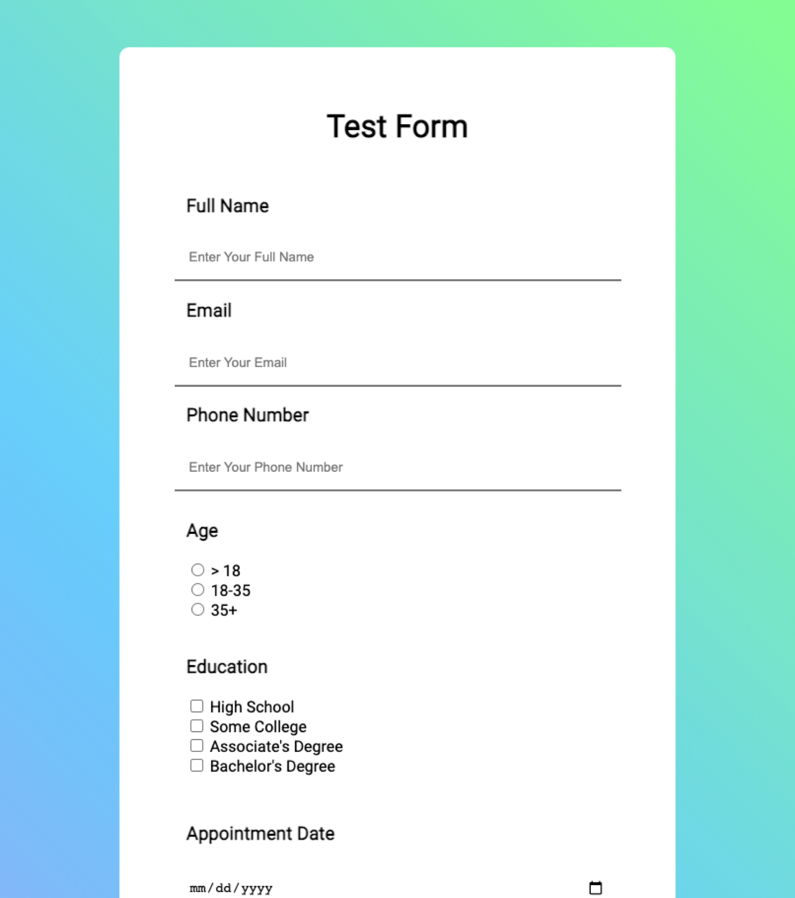
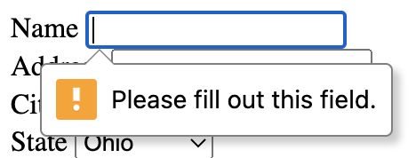
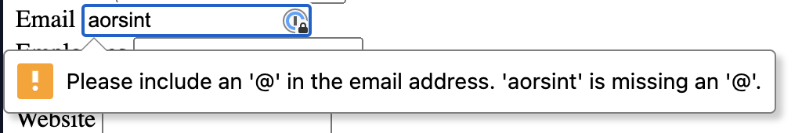

## HTML Forms

---


### Any questions about assignment?

Feel free to stay after class if you have questions

---


## HTML Forms



---

## HTML Has Built-in Form Support

### It's okay for basic forms

- Several different form field types to choose from
- Can control how and where the form data is sent
  - It takes you to that page in the browser, though
- Basic client-side form validation
- Submit button "just works"
- Reset button "just works"

---

## Anatomy of an HTML Form

```html
<h1>What's your favorite book?</h1>

<form action="http://www.foo.com" method="POST">
  <div>
    <label for="title">Title</label>
    <input name="title" id="title" />
  </div>

  <div>
    <label for="author">Author</label>
    <input name="author" id="author" />
  </div>

  <div>
    <button type="submit">Submit</button>
    <button type="reset">Reset</button>
  </div>
</form>
```

---

## What's with all the attributes?

- `action` tells the form _where_ to send the form data
- `method` tells the form _how_ to format the form data when sending ("POST" is the standard way nowadays)
- `for` and `id` associate the label and the input for assistive technologies (screen readers, etc)
- `name` is the name of the property associated with the input value when sent to the server

---

## `type`s of HTML Form Fields

Defaults to `text`

- Text input
- Email input
- Password input
- Number input
- Date input
- Color input
- Phone input (need validator regex)
- Select (aka drop down) input
- File input (requires `enctype` attribute)
- Text Area input
- Radio button select
- Check box select
- - more

---

## What is validation?

- "Validation" is the practice of making sure inputs satisfy curtain requirements
  - For example, making sure someone doesn't put their age as their name or vice versa
- Good validation holds the user's hand and helps them fill out the form correctly, improving UX
- There are two kinds of validation:
  - "Client-side" validation happens before the user submits the form to the server
    - HTML Forms Inputs come with "basic" validation baked in, mostly tied to the input's `type`
    - Advanced validation can be done with JavaScript
    - Mostly for UX
  - "Server-side" validation
    - To protect against security vulnerabilities, all forms should also have server side validation
    - Verifies inputs can be put in the database in the expected way
    - Checks things the client cannot (is this email already used, etc)

We'll only be covering basic HTML Form validation in this class.

---

## Examples of client-side validation

### Marking an input as required



```html
<input required name="name" id="name" />
```

### Enforcing an email



```html
<input type="email" name="email" id="email" />
```

---
---

## When built-in validation isn't enough

`type="email"` checks for an email shape. But what about a phone number? A zip code?

For those, HTML lets you supply your own rule — a **regular expression**.

---

## Regular expressions (regex)

A **regex** is a short pattern that describes what text is allowed.

| Piece | Means |
|---|---|
| `\d` | any digit 0-9 |
| `{5}` | exactly 5 of them |
| `{3,}` | 3 or more |
| `[A-Z]` | any capital letter |

---

## Regex in an HTML form

```html
<label for="zip">ZIP Code</label>
<input
  type="text"
  id="zip"
  name="zip"
  pattern="\d{5}"
  title="Enter a 5-digit ZIP code"
/>
```

`pattern="\d{5}"` = "five digits, nothing else."

The `title` shows up when the user gets it wrong — always include it.

---

## One more

```html
<input
  type="tel"
  pattern="\d{3}-\d{3}-\d{4}"
  title="Format: 330-941-3000"
/>
```

Don't memorize regex. Look it up when you need it — everyone does.

---

## Where do forms go?

- HTML forms need to be sent to a server by default
- We won't cover server side dev in this class

---

## Let's make a form!

We'll be using [webhook.site](http://webhook.site) to inspect our form payload

---

## A couple notes

- Checkboxes only submit when they are `on`, not `off` - kinda weird that it doesn't send true and false, but whatevs

---

## Implicit vs explicit required Select Drop downs

### Implicit

Select drop downs can be "implicitly required" by only including valid `option`s. Note that the user may accidentally submit the dropdown with the default value, without interacting with the drop down.

```html
<div>
  <label for="state">State</label>
  <select name="state" id="state">
    <option value="OH">Ohio</option>
    <option value="AK">Alaska</option>
    <option value="AZ">Arizona</option>
    <option value="AR">Arkansas</option>
  </select>
</div>
```

### Explicit

Drop downs can also be "explicitly required" by adding the `required` attribute to the `select` and having the first `option` have the value of empty string `""`. This forces the user to have to select an item from the drop down manually.

```html
<div>
  <label for="state">State</label>
  <select required name="state" id="state">
    <option value="">Select a state...</option>
    <option value="OH">Ohio</option>
    <option value="AK">Alaska</option>
    <option value="AZ">Arizona</option>
    <option value="AR">Arkansas</option>
  </select>
</div>
```

---


# Some last form things


## The Reset button

This button automatically clears all form fields.

```html
<button type="reset">Reset</button>
```

---

## Textareas

Works differently than the other text inputs... for historical reasons.

```html
<label for="description">Description</label>
<textarea id="description" name="description"></textarea>
```

Can optionally add placeholder text and specify the size in rows and columns.

```html
<label for="description">Description</label>
<textarea id="description" name="description" rows="5" cols="33">
	Can pre-fill in a description here.
</textarea>
```

---

## On checkboxes and radio buttons

<form>
  <fieldset>
    <legend>Choose your favorite monster</legend>

    <input type="radio" id="kraken" name="monster" value="K">
    <label for="kraken">Kraken</label><br>

    <input type="radio" id="sasquatch" name="monster" value="S">
    <label for="sasquatch">Sasquatch</label><br>

    <input type="radio" id="mothman" name="monster" value="M" />
    <label for="mothman">Mothman</label>

  </fieldset>
</form>

```html
<form>
  <fieldset>
    <legend>Choose your favorite monster</legend>

    <input type="radio" id="kraken" name="monster" value="K" />
    <label for="kraken">Kraken</label>

    <input type="radio" id="sasquatch" name="monster" value="S" />
    <label for="sasquatch">Sasquatch</label>

    <input type="radio" id="mothman" name="monster" value="M" />
    <label for="mothman">Mothman</label>
  </fieldset>
</form>
```

<form>
  <fieldset>
    <legend>What monsters do you like?</legend>

    <input type="checkbox" id="kraken" name="monster" value="K">
    <label for="kraken">Kraken</label>

    <input type="checkbox" id="sasquatch" name="monster" value="S">
    <label for="sasquatch">Sasquatch</label>

    <input type="checkbox" id="mothman" name="monster" value="M" />
    <label for="mothman">Mothman</label>

  </fieldset>
</form>

```html
<form>
  <fieldset>
    <legend>What monsters do you like?</legend>

    <input type="checkbox" id="kraken" name="monster" value="K" />
    <label for="kraken">Kraken</label>

    <input type="checkbox" id="sasquatch" name="monster" value="S" />
    <label for="sasquatch">Sasquatch</label>

    <input type="checkbox" id="mothman" name="monster" value="M" />
    <label for="mothman">Mothman</label>
  </fieldset>
</form>
```


<input type="checkbox" id="sasquatch" name="monster" value="S"><label for="sasquatch">Sasquatch</label>

```html
<input type="checkbox" id="sasquatch" name="monster" value="S" />
<label for="sasquatch">Sasquatch</label>
```

---

# Questions?
