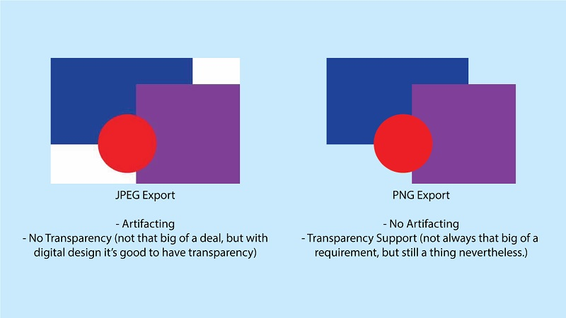
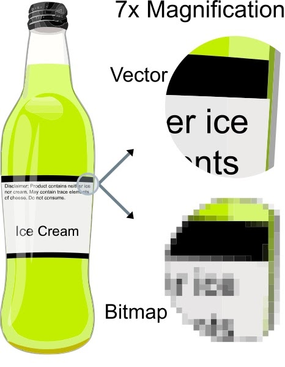

# Multimedia & Accessible Media


### Questions?

---

## HTML Quiz

- 25 random questions selected from a 60 question pool
- Questions and answers appear in random order each attempt
- Top score between retries
- Let me know if you see any typos
- Try not to use AI

### Questions?

---

# File types


# Images

## JPG / JPEG

- Raster / pixel based
- Lossy - can choose how much loss
- No alpha layer / transparency

---

## PNG

- Raster / pixel based
- Lossless
- Can have alpha layer / transparency

---



---

## GIF

- Raster / pixel based
- Can be animated
- No alpha layer / transparency
- Usually large in file size

---

## SVG

- Vector
- Can be written by a human
- Small file size
- Lossless
- Can be infinitely zoomed
- Human readable - can contain html
- Can be controlled with javascript, like html



https://www.w3schools.com/graphics/svg_intro.asp

---

## WebP

- New image format by Google
- Raster
- Can be lossy or lossless
- Can be animated
- Supported by all browsers but IE
- Fun fact: Giphy is mostly WebP

https://giphy.com/

---

## Concerns with images

- Resolution
- Big enough to look good on all devices
- Small enough to be efficient
- File size
- Layout shift
- Alt text

---

# Video

## Concerns with video

- Format/CODEC and container type
  - Some browsers support different formats, better now though
- Progressive loading (vs loading whole video at once before playing)
- Resolution/quality switching
- Streaming
- Bandwidth
- Hardware acceleration
- Can't autoplay (without weird browser hackery) anymore

---

# Audio

## Concerns with audio

- File type
- Can't autoplay anymore

---


## Let's put some videos and audio on a page

```html
<video controls src="Big_Buck_Bunny_360_10s_1MB.mp4"></video>
<audio controls src="orchestra.mp3"></audio>
```


---